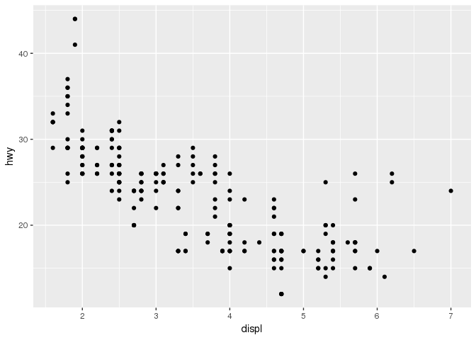

# Chapter 1. Data Visualization with ggplot2.

## Introduction
The most effective way to grasp some insights from data is to visualize it. The most effective library to 
visualize data is ggplot2. "gg" stands for grammar of graphics. To use ggplot2 we need to initialize it.


```r
library(tidyverse)
```

```
## ── Attaching packages ─────────────────────────────────────────────────────────────────────────────────────────────────────────────────── tidyverse 1.2.1 ──
```

```
## ✔ ggplot2 2.2.1     ✔ purrr   0.2.4
## ✔ tibble  1.4.2     ✔ dplyr   0.7.6
## ✔ tidyr   0.8.0     ✔ stringr 1.3.1
## ✔ readr   1.1.1     ✔ forcats 0.3.0
```

```
## ── Conflicts ────────────────────────────────────────────────────────────────────────────────────────────────────────────────────── tidyverse_conflicts() ──
## ✖ dplyr::filter() masks stats::filter()
## ✖ dplyr::lag()    masks stats::lag()
```

This one line of code loads different packages to analyze and visualize data. There's some conflicts in 
function names of dplyr package and core R functions. To specify function from package we need to write 
package::function. For example: dplyr::filter().


## First Steps
Let's use ggplot2 package to answer a question: do cars with big engine use more fuel than cars with 
small engine? It is intuitive that they do, but let's prove it visually. In addition, we can find out 
if releationship between engine size and fuel efficiency is linear or nonlinear. We used preload data 
from ggplot2 - mpg. It is observations of 234 cars from US Environment Protection Agency. 


```r
df = ggplot2::mpg
head(df)
```

```
## # A tibble: 6 x 11
##   manufacturer model displ  year   cyl trans drv     cty   hwy fl    class
##   <chr>        <chr> <dbl> <int> <int> <chr> <chr> <int> <int> <chr> <chr>
## 1 audi         a4      1.8  1999     4 auto… f        18    29 p     comp…
## 2 audi         a4      1.8  1999     4 manu… f        21    29 p     comp…
## 3 audi         a4      2    2008     4 manu… f        20    31 p     comp…
## 4 audi         a4      2    2008     4 auto… f        21    30 p     comp…
## 5 audi         a4      2.8  1999     6 auto… f        16    26 p     comp…
## 6 audi         a4      2.8  1999     6 manu… f        18    26 p     comp…
```


## Creating a ggplot
The most effective way to show relationship between two variables is scatter plot. We use _displ_ as x axis
and _hwy_ as y axis.


```r
ggplot(df) +
    geom_point(mapping = aes(x = displ, y = hwy))
```

<!-- -->

The scatter plot shows negative relationship between fuel efficiency and engine size. Which means that 
cars with bigger engines consume more fuel. 
_ggplot()_ function creates empty graph, then with *geom_point()* function we add points layer to empty 
graph.


