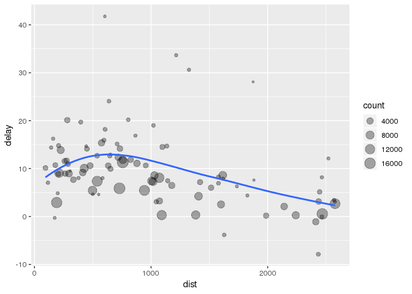
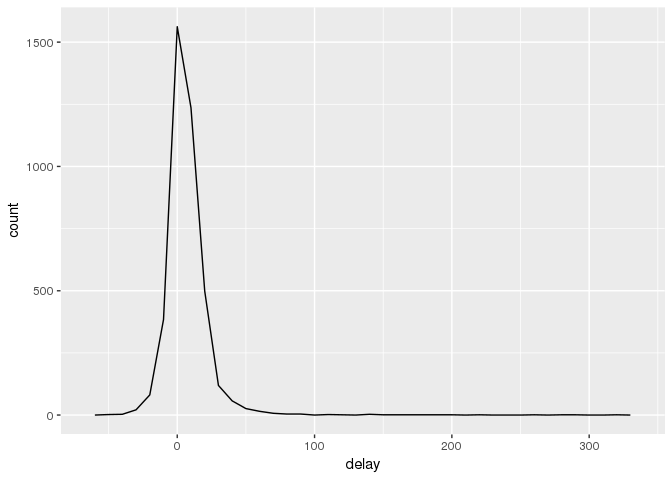
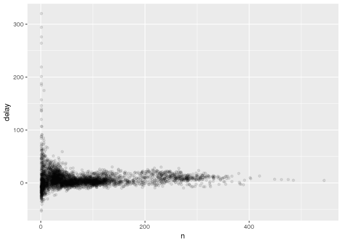
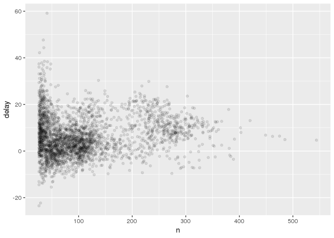

# Chapter 3


```r
library(nycflights13)
library(tidyverse)
```

```
## ── Attaching packages ──────────────────────────────────────────────────────────────────────────────────────────────────────────────────────────── tidyverse 1.2.1 ──
```

```
## ✔ ggplot2 3.0.0     ✔ purrr   0.2.5
## ✔ tibble  1.4.2     ✔ dplyr   0.7.6
## ✔ tidyr   0.8.1     ✔ stringr 1.3.1
## ✔ readr   1.1.1     ✔ forcats 0.3.0
```

```
## ── Conflicts ─────────────────────────────────────────────────────────────────────────────────────────────────────────────────────────────── tidyverse_conflicts() ──
## ✖ dplyr::filter() masks stats::filter()
## ✖ dplyr::lag()    masks stats::lag()
```

To try _dplyr_ package we will use nyflights13::flights data, which is all flights departed from NY in 2013. 
Let's see data itself:


```r
df = nycflights13::flights

head(df)
```

```
## # A tibble: 6 x 19
##    year month   day dep_time sched_dep_time dep_delay arr_time
##   <int> <int> <int>    <int>          <int>     <dbl>    <int>
## 1  2013     1     1      517            515         2      830
## 2  2013     1     1      533            529         4      850
## 3  2013     1     1      542            540         2      923
## 4  2013     1     1      544            545        -1     1004
## 5  2013     1     1      554            600        -6      812
## 6  2013     1     1      554            558        -4      740
## # ... with 12 more variables: sched_arr_time <int>, arr_delay <dbl>,
## #   carrier <chr>, flight <int>, tailnum <chr>, origin <chr>, dest <chr>,
## #   air_time <dbl>, distance <dbl>, hour <dbl>, minute <dbl>,
## #   time_hour <dttm>
```

This data in tibble format, which is more optimized to work with tidyverse. All columns have their own 
types as int, dbl, chr, dttm. There's 7 types in tibble dataformat:

* int - integer numbers
* dbl - real numbers
* chr - character vectors or strings
* dttm - datetime
* lgl - boolean TRUE or FALSE
* fctr - categorical variables
* date - dates

## dplyr basics
dplyr package has 5 key functions:

* filter() - select given rows from dataset
* arrange() - reorder rows
* select() - pick columns by their names
* mutate() - create new columns
* summarize() - grouping data by some summary stats

## Filter Rows
*filter()* allows to subset observations based on some logic. For example, if we want to select all 
flights from January 1st:


```r
jan1 = filter(df, month == 1, day == 1)
```

R saves result to a variable. If you want to print out filtering and assign to some variable, you can wrap 
up into parentheses.


```r
(dec25 = filter(df, month == 12, day == 25))
```

```
## # A tibble: 719 x 19
##     year month   day dep_time sched_dep_time dep_delay arr_time
##    <int> <int> <int>    <int>          <int>     <dbl>    <int>
##  1  2013    12    25      456            500        -4      649
##  2  2013    12    25      524            515         9      805
##  3  2013    12    25      542            540         2      832
##  4  2013    12    25      546            550        -4     1022
##  5  2013    12    25      556            600        -4      730
##  6  2013    12    25      557            600        -3      743
##  7  2013    12    25      557            600        -3      818
##  8  2013    12    25      559            600        -1      855
##  9  2013    12    25      559            600        -1      849
## 10  2013    12    25      600            600         0      850
## # ... with 709 more rows, and 12 more variables: sched_arr_time <int>,
## #   arr_delay <dbl>, carrier <chr>, flight <int>, tailnum <chr>,
## #   origin <chr>, dest <chr>, air_time <dbl>, distance <dbl>, hour <dbl>,
## #   minute <dbl>, time_hour <dttm>
```


## Comparisons
R has standard comparison operators like: >, <, >=, <=, ==. Since R store finite number of digits in float 
numbers, you can observe some strange behavior:


```r
sqrt(2) ^ 2 == 2
```

```
## [1] FALSE
```

Instead of using "==", you should use _near()_ function for those kind of comparisons.


```r
near(sqrt(2)^2, 2)
```

```
## [1] TRUE
```


## Logical Operators
For "and" operator you can use "&" sign, for "or" use "|", and "!" for "not".


```r
filter(df, month == 11 | month == 12)
```

```
## # A tibble: 55,403 x 19
##     year month   day dep_time sched_dep_time dep_delay arr_time
##    <int> <int> <int>    <int>          <int>     <dbl>    <int>
##  1  2013    11     1        5           2359         6      352
##  2  2013    11     1       35           2250       105      123
##  3  2013    11     1      455            500        -5      641
##  4  2013    11     1      539            545        -6      856
##  5  2013    11     1      542            545        -3      831
##  6  2013    11     1      549            600       -11      912
##  7  2013    11     1      550            600       -10      705
##  8  2013    11     1      554            600        -6      659
##  9  2013    11     1      554            600        -6      826
## 10  2013    11     1      554            600        -6      749
## # ... with 55,393 more rows, and 12 more variables: sched_arr_time <int>,
## #   arr_delay <dbl>, carrier <chr>, flight <int>, tailnum <chr>,
## #   origin <chr>, dest <chr>, air_time <dbl>, distance <dbl>, hour <dbl>,
## #   minute <dbl>, time_hour <dttm>
```

Instaed of using "|" in above exercise, it is more appropriate to use %in%.


```r
nov_dec = filter(df, month %in% c(11, 12))
```


## Arrange Rows with arrange()
_arrange()_ works in similar way as filter, except it just reorder rows in given columns.


```r
arrange(df, year, month, day)
```

```
## # A tibble: 336,776 x 19
##     year month   day dep_time sched_dep_time dep_delay arr_time
##    <int> <int> <int>    <int>          <int>     <dbl>    <int>
##  1  2013     1     1      517            515         2      830
##  2  2013     1     1      533            529         4      850
##  3  2013     1     1      542            540         2      923
##  4  2013     1     1      544            545        -1     1004
##  5  2013     1     1      554            600        -6      812
##  6  2013     1     1      554            558        -4      740
##  7  2013     1     1      555            600        -5      913
##  8  2013     1     1      557            600        -3      709
##  9  2013     1     1      557            600        -3      838
## 10  2013     1     1      558            600        -2      753
## # ... with 336,766 more rows, and 12 more variables: sched_arr_time <int>,
## #   arr_delay <dbl>, carrier <chr>, flight <int>, tailnum <chr>,
## #   origin <chr>, dest <chr>, air_time <dbl>, distance <dbl>, hour <dbl>,
## #   minute <dbl>, time_hour <dttm>
```

_desc()_ function will make reverse order of values in columns:


```r
arrange(df, desc(arr_delay))
```

```
## # A tibble: 336,776 x 19
##     year month   day dep_time sched_dep_time dep_delay arr_time
##    <int> <int> <int>    <int>          <int>     <dbl>    <int>
##  1  2013     1     9      641            900      1301     1242
##  2  2013     6    15     1432           1935      1137     1607
##  3  2013     1    10     1121           1635      1126     1239
##  4  2013     9    20     1139           1845      1014     1457
##  5  2013     7    22      845           1600      1005     1044
##  6  2013     4    10     1100           1900       960     1342
##  7  2013     3    17     2321            810       911      135
##  8  2013     7    22     2257            759       898      121
##  9  2013    12     5      756           1700       896     1058
## 10  2013     5     3     1133           2055       878     1250
## # ... with 336,766 more rows, and 12 more variables: sched_arr_time <int>,
## #   arr_delay <dbl>, carrier <chr>, flight <int>, tailnum <chr>,
## #   origin <chr>, dest <chr>, air_time <dbl>, distance <dbl>, hour <dbl>,
## #   minute <dbl>, time_hour <dttm>
```

Important note, that missing vaslues (NAs) are always sorted at the end!


## Select Columns with select()
With _select()_ function you can select given columns by their names.


```r
select(df, year, month, day)
```

```
## # A tibble: 336,776 x 3
##     year month   day
##    <int> <int> <int>
##  1  2013     1     1
##  2  2013     1     1
##  3  2013     1     1
##  4  2013     1     1
##  5  2013     1     1
##  6  2013     1     1
##  7  2013     1     1
##  8  2013     1     1
##  9  2013     1     1
## 10  2013     1     1
## # ... with 336,766 more rows
```

Select all columns between year and day:

```r
select(df, year:day)
```

```
## # A tibble: 336,776 x 3
##     year month   day
##    <int> <int> <int>
##  1  2013     1     1
##  2  2013     1     1
##  3  2013     1     1
##  4  2013     1     1
##  5  2013     1     1
##  6  2013     1     1
##  7  2013     1     1
##  8  2013     1     1
##  9  2013     1     1
## 10  2013     1     1
## # ... with 336,766 more rows
```

Select all columns except from year and day:


```r
select(df, -(year:day))
```

```
## # A tibble: 336,776 x 16
##    dep_time sched_dep_time dep_delay arr_time sched_arr_time arr_delay
##       <int>          <int>     <dbl>    <int>          <int>     <dbl>
##  1      517            515         2      830            819        11
##  2      533            529         4      850            830        20
##  3      542            540         2      923            850        33
##  4      544            545        -1     1004           1022       -18
##  5      554            600        -6      812            837       -25
##  6      554            558        -4      740            728        12
##  7      555            600        -5      913            854        19
##  8      557            600        -3      709            723       -14
##  9      557            600        -3      838            846        -8
## 10      558            600        -2      753            745         8
## # ... with 336,766 more rows, and 10 more variables: carrier <chr>,
## #   flight <int>, tailnum <chr>, origin <chr>, dest <chr>, air_time <dbl>,
## #   distance <dbl>, hour <dbl>, minute <dbl>, time_hour <dttm>
```

There are some helper function to use in select:

- starts_with("a") matches column names which starts with "a"
- ends_with("a") matches column names which ends with "a"
- contains("dgh") matches column names which contains "dgh"
- matches("(.)\\1") matches column names due to regular expression
- num_range("col", 1:3) matches "col1", "col2", "col3"

To rename column name you should use _rename()_ function:


```r
rename(df, tail_num = tailnum)
```

```
## # A tibble: 336,776 x 19
##     year month   day dep_time sched_dep_time dep_delay arr_time
##    <int> <int> <int>    <int>          <int>     <dbl>    <int>
##  1  2013     1     1      517            515         2      830
##  2  2013     1     1      533            529         4      850
##  3  2013     1     1      542            540         2      923
##  4  2013     1     1      544            545        -1     1004
##  5  2013     1     1      554            600        -6      812
##  6  2013     1     1      554            558        -4      740
##  7  2013     1     1      555            600        -5      913
##  8  2013     1     1      557            600        -3      709
##  9  2013     1     1      557            600        -3      838
## 10  2013     1     1      558            600        -2      753
## # ... with 336,766 more rows, and 12 more variables: sched_arr_time <int>,
## #   arr_delay <dbl>, carrier <chr>, flight <int>, tail_num <chr>,
## #   origin <chr>, dest <chr>, air_time <dbl>, distance <dbl>, hour <dbl>,
## #   minute <dbl>, time_hour <dttm>
```

If you want to move some columns to the begining, function _everything()_ can be helpful:


```r
select(df, time_hour, air_time, everything())
```

```
## # A tibble: 336,776 x 19
##    time_hour           air_time  year month   day dep_time sched_dep_time
##    <dttm>                 <dbl> <int> <int> <int>    <int>          <int>
##  1 2013-01-01 05:00:00      227  2013     1     1      517            515
##  2 2013-01-01 05:00:00      227  2013     1     1      533            529
##  3 2013-01-01 05:00:00      160  2013     1     1      542            540
##  4 2013-01-01 05:00:00      183  2013     1     1      544            545
##  5 2013-01-01 06:00:00      116  2013     1     1      554            600
##  6 2013-01-01 05:00:00      150  2013     1     1      554            558
##  7 2013-01-01 06:00:00      158  2013     1     1      555            600
##  8 2013-01-01 06:00:00       53  2013     1     1      557            600
##  9 2013-01-01 06:00:00      140  2013     1     1      557            600
## 10 2013-01-01 06:00:00      138  2013     1     1      558            600
## # ... with 336,766 more rows, and 12 more variables: dep_delay <dbl>,
## #   arr_time <int>, sched_arr_time <int>, arr_delay <dbl>, carrier <chr>,
## #   flight <int>, tailnum <chr>, origin <chr>, dest <chr>, distance <dbl>,
## #   hour <dbl>, minute <dbl>
```


## Add New Variables with mutate()
_mutate()_ function used to create new variables from existing ones with some transformation functions. 


```r
df_sml = select(df, year:day, ends_with('delay'), distance, air_time)
(mutate(df_sml, gain = arr_delay - dep_delay, speed = distance / air_time * 60))
```

```
## # A tibble: 336,776 x 9
##     year month   day dep_delay arr_delay distance air_time  gain speed
##    <int> <int> <int>     <dbl>     <dbl>    <dbl>    <dbl> <dbl> <dbl>
##  1  2013     1     1         2        11     1400      227     9  370.
##  2  2013     1     1         4        20     1416      227    16  374.
##  3  2013     1     1         2        33     1089      160    31  408.
##  4  2013     1     1        -1       -18     1576      183   -17  517.
##  5  2013     1     1        -6       -25      762      116   -19  394.
##  6  2013     1     1        -4        12      719      150    16  288.
##  7  2013     1     1        -5        19     1065      158    24  404.
##  8  2013     1     1        -3       -14      229       53   -11  259.
##  9  2013     1     1        -3        -8      944      140    -5  405.
## 10  2013     1     1        -2         8      733      138    10  319.
## # ... with 336,766 more rows
```

*mutate()* function allow you to use previously created variables as reference:


```r
(mutate(df_sml, gain = arr_delay - dep_delay, hours = air_time / 60, gain_per_hour = gain / hours))
```

```
## # A tibble: 336,776 x 10
##     year month   day dep_delay arr_delay distance air_time  gain hours
##    <int> <int> <int>     <dbl>     <dbl>    <dbl>    <dbl> <dbl> <dbl>
##  1  2013     1     1         2        11     1400      227     9 3.78 
##  2  2013     1     1         4        20     1416      227    16 3.78 
##  3  2013     1     1         2        33     1089      160    31 2.67 
##  4  2013     1     1        -1       -18     1576      183   -17 3.05 
##  5  2013     1     1        -6       -25      762      116   -19 1.93 
##  6  2013     1     1        -4        12      719      150    16 2.5  
##  7  2013     1     1        -5        19     1065      158    24 2.63 
##  8  2013     1     1        -3       -14      229       53   -11 0.883
##  9  2013     1     1        -3        -8      944      140    -5 2.33 
## 10  2013     1     1        -2         8      733      138    10 2.3  
## # ... with 336,766 more rows, and 1 more variable: gain_per_hour <dbl>
```

If you want to keep only new created variable, use _transmute()_:


```r
(transmute(df, gain = arr_delay - dep_delay, hours = air_time / 60, gain_per_hour = gain / hours))
```

```
## # A tibble: 336,776 x 3
##     gain hours gain_per_hour
##    <dbl> <dbl>         <dbl>
##  1     9 3.78           2.38
##  2    16 3.78           4.23
##  3    31 2.67          11.6 
##  4   -17 3.05          -5.57
##  5   -19 1.93          -9.83
##  6    16 2.5            6.4 
##  7    24 2.63           9.11
##  8   -11 0.883        -12.5 
##  9    -5 2.33          -2.14
## 10    10 2.3            4.35
## # ... with 336,766 more rows
```

## Useful Creation Functions
There are many functions that you can use to create new variables. It includes basic arithmetic operations, 
log and exp functions, offsets like _lag()_ and _lead()_, cumulative and rolling aggregates like _cumsum()_, 
_cumprod()_, _cummin()_, _cummax()_, _cummean()_, logical opeartions like ">", "<", ">=", "<=", rankings 
like *min_rank()*, *row_number()*, *dense_rank()*, *percent_rank()*, *cume_dist()*, *ntitle()*. 


## Grouped Summaries with summarize()
*summarize()* function collapse a data frame to a single row. It's useful with *group_by()* function. For 
example if you want to obtain average delay per day:


```r
(group_by(df, year, month, day) %>%
     summarize(delay = mean(dep_delay, na.rm = T)))
```

```
## # A tibble: 365 x 4
## # Groups:   year, month [?]
##     year month   day delay
##    <int> <int> <int> <dbl>
##  1  2013     1     1 11.5 
##  2  2013     1     2 13.9 
##  3  2013     1     3 11.0 
##  4  2013     1     4  8.95
##  5  2013     1     5  5.73
##  6  2013     1     6  7.15
##  7  2013     1     7  5.42
##  8  2013     1     8  2.55
##  9  2013     1     9  2.28
## 10  2013     1    10  2.84
## # ... with 355 more rows
```


## Combining Multiple Operations with the Pipe
If you want to get relationship between distance and average delay, you can get data with *group_by()*, 
*summarize()* and *filter()*:


```r
delay = df %>%
    group_by(dest) %>%
    summarize(count = n(),
              dist = mean(distance, na.rm = T),
              delay = mean(arr_delay, na.rm = T)) %>%
    filter(count > 20, dest != "HNL")

ggplot(data = delay, mapping = aes(x = dist, y = delay)) + 
    geom_point(aes(size = count), alpha = 1/3) + 
    geom_smooth(se = F)
```

```
## `geom_smooth()` using method = 'loess' and formula 'y ~ x'
```

<!-- -->


## Missing Values
If you don't use na.rm argument, aggregate functions in summarize yield _na_ values. 


```r
(df %>%
     group_by(year, month, day) %>%
     summarize(mean = mean(dep_delay)))
```

```
## # A tibble: 365 x 4
## # Groups:   year, month [?]
##     year month   day  mean
##    <int> <int> <int> <dbl>
##  1  2013     1     1    NA
##  2  2013     1     2    NA
##  3  2013     1     3    NA
##  4  2013     1     4    NA
##  5  2013     1     5    NA
##  6  2013     1     6    NA
##  7  2013     1     7    NA
##  8  2013     1     8    NA
##  9  2013     1     9    NA
## 10  2013     1    10    NA
## # ... with 355 more rows
```

If there's any _na_ values in column, aggregate functions always return _na_ values for entire result. 
Fortunately, all aggregate functions have _na.rm_ argument, which removes missing values prior to calculation. 


```r
(df %>%
     group_by(year, month, day) %>%
     summarize(mean = mean(dep_delay, na.rm = T)))
```

```
## # A tibble: 365 x 4
## # Groups:   year, month [?]
##     year month   day  mean
##    <int> <int> <int> <dbl>
##  1  2013     1     1 11.5 
##  2  2013     1     2 13.9 
##  3  2013     1     3 11.0 
##  4  2013     1     4  8.95
##  5  2013     1     5  5.73
##  6  2013     1     6  7.15
##  7  2013     1     7  5.42
##  8  2013     1     8  2.55
##  9  2013     1     9  2.28
## 10  2013     1    10  2.84
## # ... with 355 more rows
```


## Count
It is always good idea to include _count_ to aggregated data with _n()_, or count of non-na values with 
_sum(!is.na(x))_. It helps you to avoid working with small number of observations in aggreagted data. 
For example let's plot highest average delays identified by tailnum:


```r
delays = df %>%
    filter(!is.na(dep_delay), !is.na(arr_delay)) %>%
    group_by(tailnum) %>%
    summarize(delay = mean(arr_delay))

ggplot(data = delays, mapping = aes(x = delay)) + 
    geom_freqpoly(binwidth = 10)
```

<!-- -->

From plot above you can see that some planes have 5 hours average delays. But if you plot scatterplot 
of average delay and number of observations, you can understand that plot above is not reliable:


```r
delays = df %>%
    filter(!is.na(arr_delay), !is.na(dep_delay)) %>%
    group_by(tailnum) %>%
    summarize(delay = mean(arr_delay, na.rm = T)
              ,n = n())

ggplot(data = delays, mapping = aes(x = n, y = delay)) + 
    geom_point(alpha = 1/10)
```

<!-- -->

You should notice that with smaller number of observations, you have bigger variations of average delays. 
So, it is a good idea to filter out small number of observations from data frame:


```r
delays %>%
    filter(n > 25) %>%
    ggplot(mapping = aes(x = n, y = delay)) + 
    geom_point(alpha = 1 / 10)
```

<!-- -->


## Useful Summary Functions
Sometimes _median_ value more useful than _mean_. Also, you can use some logical subsetting in _summarize_ 
function.


```r
(df %>%
    filter(!is.na(arr_delay)) %>%
    group_by(year, month, day) %>%
    summarize(avg_delay1 = mean(arr_delay, na.rm = T)
              ,avg_delay2 = mean(arr_delay[arr_delay > 0], na.rm = T)
              ,median_delay = median(arr_delay, na.rm = T)))
```

```
## # A tibble: 365 x 6
## # Groups:   year, month [?]
##     year month   day avg_delay1 avg_delay2 median_delay
##    <int> <int> <int>      <dbl>      <dbl>        <dbl>
##  1  2013     1     1     12.7         32.5            3
##  2  2013     1     2     12.7         32.0            4
##  3  2013     1     3      5.73        27.7            1
##  4  2013     1     4     -1.93        28.3           -8
##  5  2013     1     5     -1.53        22.6           -7
##  6  2013     1     6      4.24        24.4           -1
##  7  2013     1     7     -4.95        27.8          -10
##  8  2013     1     8     -3.23        20.8           -7
##  9  2013     1     9     -0.264       25.6           -6
## 10  2013     1    10     -5.90        27.3          -11
## # ... with 355 more rows
```

Measures of spread like standard deviation (sd), interquartile range (IQR) and median absolute deviation 
(mad) are very useful functions to understand data.


```r
(df %>%
    group_by(dest) %>%
    summarize(distance_sd = sd(distance, na.rm = T)
              ,distance_IQR = IQR(distance, na.rm = T)
              ,distance_mad = mad(distance, na.rm = T)))
```

```
## # A tibble: 105 x 4
##    dest  distance_sd distance_IQR distance_mad
##    <chr>       <dbl>        <dbl>        <dbl>
##  1 ABQ        0                 0            0
##  2 ACK        0                 0            0
##  3 ALB        0                 0            0
##  4 ANC        0                 0            0
##  5 ATL        7.16             16            0
##  6 AUS        8.32             17            0
##  7 AVL        3.00              0            0
##  8 BDL        0                 0            0
##  9 BGR        0                 0            0
## 10 BHM        0.0580            0            0
## # ... with 95 more rows
```

Measures of rank help to find particular quantile value, or min, max values:


```r
(df %>%
     group_by(year, month, day) %>%
     summarize(first = min(dep_time, na.rm = T)
               ,last = max(dep_time, na.rm = T)
               ,q25 = quantile(dep_time, 0.25, na.rm = T)
               ,q75 = quantile(dep_time, 0.75, na.rm = T)))
```

```
## # A tibble: 365 x 7
## # Groups:   year, month [?]
##     year month   day first  last   q25   q75
##    <int> <int> <int> <int> <int> <dbl> <dbl>
##  1  2013     1     1   517  2356  940. 1757.
##  2  2013     1     2    42  2354  912. 1750.
##  3  2013     1     3    32  2349  909  1756.
##  4  2013     1     4    25  2358  901  1745 
##  5  2013     1     5    14  2357  859  1710 
##  6  2013     1     6    16  2355 1004  1758 
##  7  2013     1     7    49  2359  907. 1728 
##  8  2013     1     8   454  2351  858  1728.
##  9  2013     1     9     2  2252  858  1725 
## 10  2013     1    10     3  2320  859  1733 
## # ... with 355 more rows
```

Counts calculated not only with _n()_, but also with _sum(!is.na(x))_ for non-missing values, *n_distinct()* 
for distinct amount of values:


```r
(df %>%
    group_by(dest) %>%
    summarize(cnt = n()
              ,cnt_distinct = n_distinct(carrier)) %>%
    arrange(desc(cnt_distinct)))
```

```
## # A tibble: 105 x 3
##    dest    cnt cnt_distinct
##    <chr> <int>        <int>
##  1 ATL   17215            7
##  2 BOS   15508            7
##  3 CLT   14064            7
##  4 ORD   17283            7
##  5 TPA    7466            7
##  6 AUS    2439            6
##  7 DCA    9705            6
##  8 DTW    9384            6
##  9 IAD    5700            6
## 10 MSP    7185            6
## # ... with 95 more rows
```


